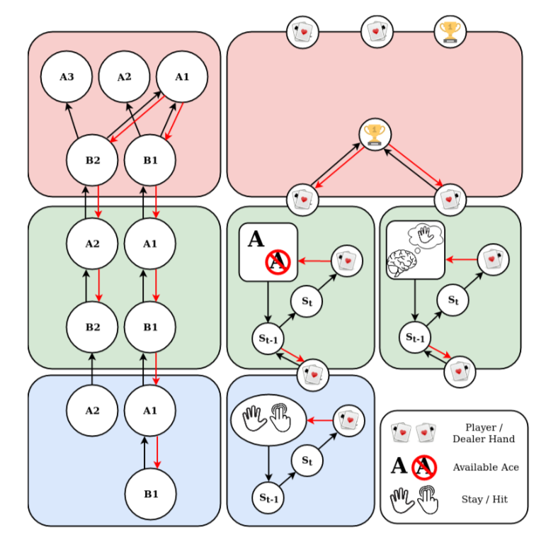

# BlackjActive Inference

Bottom/Blue: Level one. At this level there are two outcomes encoding the player’s and the dealer’s current hand, respectively, and no explicit prior preferences. The player may choose to either hit (two fingers) or stay (open palm). It is assumed that both the player and dealer hands are sampled in parallel to imply simultaneous belief updates at the next level in the hierarchy.

Middle/Green: Level two. At this level there are two outcomes encoding beliefs about the state of the game at the next timestep. The player may assume that the dealer will ‘stay’ (or not), propagating beliefs about the most optimal (motivation) and/or achievable (control) hidden states to the next level. At this
level the player must actively contextualize their hand with an Ace if one is available. In our simulations the agent must report its use of the Ace to be used in gameplay – simply having an ace will not result in optimal use, however retroactive usage is permitted. For example, if the agent chooses to hit under the assumption that A=11 but goes bust, the agent may retroactively revalue A as A=1 as per the rules of the game. The introspective outcomes for both player and dealer hands are thus subject to the agent’s beliefs about the exteroceptive inputs (level 1) and semantic beliefs about the environmental contingencies, represented/constrained here by a dual factorization between hierarchichal levels and state representations.

Top/Red: Level three. At this level there are three outcomes encoding the player’s and the dealer’s hand at the end of the game as well as a win/lose/draw categorization with bust/higher card sub-categories. Prior preferences about outcomes are prescribed explicitly, and thus at all levels of the hierarchy implicitly, with respect to this categorization only.
The agent is driven by a single incentive to win the game, prescribed at the highest level of the hierarchy. In order to win the game the agent must infer the outcome of its own hit/hold actions while contextualizing this inference with beliefs about the dealer’s behaviour and how both of these factors may contribute to winning or losing. Action and decision making thus requires the agent to acquire beliefs about the utilitarian and epistemic value of policies at all levels of the hierarchy. The representation of future and final states are separated by proximal (semantic) and distal (episodic) hierarchical levels, respectively, forming the 2-level introspective component of the generative model.

Active inference ensures that decision making at the semantic level and action at the proprioceptive level jointly actualize predications from the episodic level; introspection under this scheme corresponds to the contextualization of action dependent outcomes at the exteroceptive level while the choice to hit/stay at is biased by introspection, embodied by semantic and episodic beliefs propagated from superordinate levels. A prediction such as ‘I am going to win’ at the highest (episodic) level results in an optimistic prediction about events at the semantic level; for example, the prediction/belief/expectation ‘based on my current hand, if I use my available ace and the dealer does not take another card, I will win!’, relies on evidence reported from the exteroceptive (lowest) level and goal-directed expectations from the episodic level. When the agent infers the dealers next action at the semantic (2nd) level; this binary choice behaviour then influences top-down goal-directed behaviour, for example, incentives at the 3rd (epistemic) level may shift from getting as close to 21 as possible to simply getting a higher hand than the dealer, which may correspond to a stay action if this is already the case.
Due to the stochastic nature of the game, each level of the interoceptive hierarchy must deal with information that conflicts with its predictions. For example, the dealer may hit even when we expect it to stay (semantic) or the dealer gets blackjack on their first or second card (episodic). A dealer with a fixed policy, as assumed here, produces a hand value that is conditionally independent from the player’s hand until the game is over which is facilitated by the factorization of player and dealer hands at the semantic (second) level. This may not be the case for stochastic or other forms of Bayes-rational dealers though the model-based facilitation of more complex beliefs about dealer behaviour may be the subject of future work incorporating recursive and interpersonal treatments of active inference.
